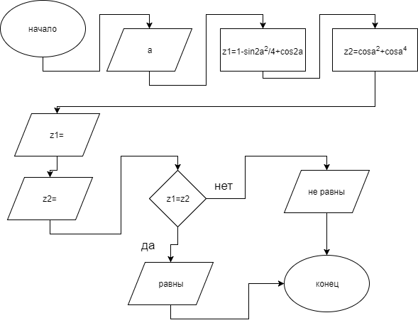
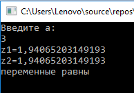

# Программа 
*(не помню что это точно было, но эту лабу засчитали)*


Эта программа запрашивает переменную α у пользователя, а затем вычисляет выражения:

    z1=1 – ¼ * sin2 (α) + cos2α
    z2=cos2α +cos4α
и сравнивает получившийся результат.

Используемый язык - C#.

### Блок-схема:


``` C#
    using System;
    using System.Collections.Generic;
    using System.Linq;
    using System.Text;
    using System.Threading.Tasks;

    namespace ConsoleApp5_17._10._2017
    {
        class Program
        {
            static void Main(string[] args)
            {
                Double z1, z2, a;
            
    Console.WriteLine("Введите a:");
                a = Double.Parse(Console.ReadLine());
        
            
                z1 = 1 - (Math.Sin(2*a) * Math.Sin(2*a))/4 + Math.Cos(2*a);
                z2 = Math.Cos(a) * Math.Cos(a) + Math.Cos(a) * Math.Cos(a) * Math.Cos(a) * Math.Cos(a);
                Console.WriteLine("z1=" + (z1));
                Console.WriteLine("z2=" + (z2));
                if (z1==z2)
                {
                    Console.WriteLine("переменные равны");
                }
                else
                {
                    Console.WriteLine("переменные не равны");
                }
                Console.ReadKey();
            }
        }
    }
```


### Результат:

