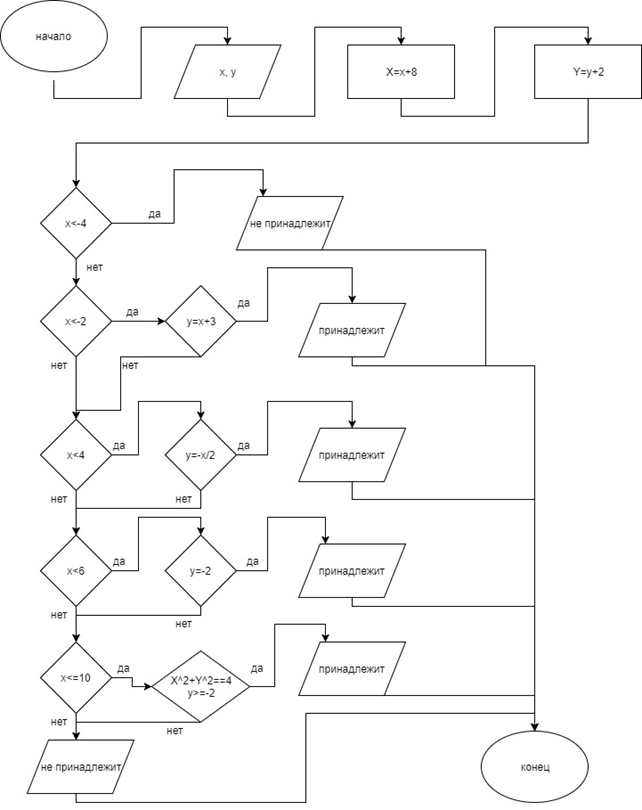
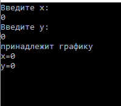
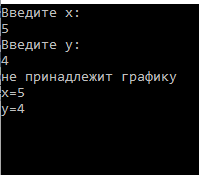

## Программа, при введенных х и у (координатах) вычисляет, принадлежит ли точка заданному графику, или нет.

Используемый язык - C#.

### Блок-схема:



``` C#
    using System;
    using System.Collections.Generic;
    using System.Linq;
    using System.Text;
    using System.Threading.Tasks;

    namespace ConsoleApp5_17._10._2017
    {
        class Program
        {
            static void Main(string[] args)
            {
                Double x, y, X, Y;
            
                Console.WriteLine("Введите x:");
                x = Double.Parse(Console.ReadLine());
                Console.WriteLine("Введите y:");
                y = Double.Parse(Console.ReadLine());

                X = x - 8;
                Y = y + 2;

                if (y>1)
                    Console.WriteLine("не принадлежит графику");
                if (y<-2)
                    Console.WriteLine("не принадлежит графику");


                if (x < -4)
                    Console.WriteLine("не принадлежит графику");
                else
                if (x < -2)
                {
                    if (y == x + 3)
                        Console.WriteLine("принадлежит графику");
                }


                else
                if (x < 4)
                {
                    if (y == -0.5 * x)
                        Console.WriteLine("принадлежит графику");
                }

                else

                if (x < 6)
                {
                    if (y == -2)
                        Console.WriteLine("принадлежит графику");

                }
                else
                    if (x <= 10)
                {
                    if (Math.Pow(X,2) + Math.Pow(Y, 2) == 4&&y>=-2)
                    
                        Console.WriteLine("принадлежит графику");
                    else

                        Console.WriteLine("не принадлежит графику");
                }
                else
                    Console.WriteLine("не принадлежит графику");        
                Console.WriteLine("x="+x);
                Console.WriteLine("y=" +y);
                Console.ReadKey();
            }
        }
    }

```

### Результат:

