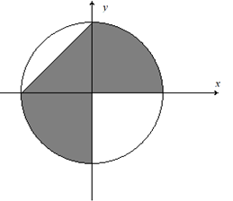
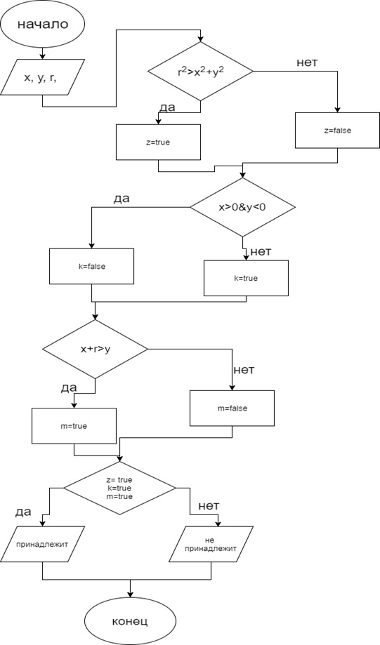
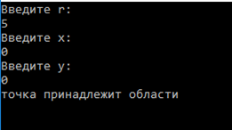

# Программа, высчитывающая, принадлежит ли заданная точка фигуре.

Используемый язык - C#.

Фигура:



Радиус фигуры задается пользователем, как и координаты точки.

### Блок-схема:


Код:
``` C#
    using System;
    using System.Collections.Generic;
    using System.Linq;
    using System.Text;
    using System.Threading.Tasks;

    namespace CА_график_
    {
        class Program
        {
            static void Main(string[] args)
            {
                Double x, y, r;
                bool z, k, m;
                Console.WriteLine("Введите r:");
                r = Double.Parse(Console.ReadLine());
                Console.WriteLine("Введите x:");
                x = Double.Parse(Console.ReadLine());
                Console.WriteLine("Введите y:");
                y = Double.Parse(Console.ReadLine());


                if (r * r > x * x + y * y)
                z = true;
                else z = false;

                if (x > 0 && y < 0)
                k = false;
                else k = true;

                if (x + r > y)
                    m = true;
                else m = false;

                if (m==true && z == true && k == true)
                    Console.WriteLine("точка принадлежит области");
                else Console.WriteLine("точка НЕ принадлежит области");


                Console.ReadKey();


            }
        }
    }
```

Результат: 

