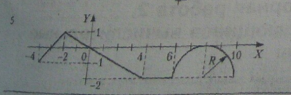

## Вывод в консоль координат графика с шагом, который задает пользователь

График:

Функции графика:

$y = x + 3;$            &emsp;&emsp;&emsp;&emsp;&emsp;&emsp;&ensp; $x<-2$

$y = -0.5 * x;$         &emsp;&emsp;&emsp;&emsp;&emsp;$-2<=x<=4$

$y = -2;$                &emsp;&emsp;&emsp;&emsp;&emsp;&emsp;&emsp;&emsp;&emsp;$4<x<6$

$y=\sqrt{4-(x-8)^2}-2$    &emsp;&emsp;&ensp;$6<=x<=10$

## Код:
    namespace лаб.раб._4
    {
        class Program
        {
                    
            static void Main(string[] args)
            {
                
                double xn = -4;
                double xk = 10;
                Console.WriteLine("введите шаг");
                double dx = double.Parse(Console.ReadLine());
                Console.WriteLine("     x         y");
                for (double x = xn; x <= xk; x = x + dx)
                {
                    double y = 0;
                    
                    if (x < -2)
                        y = x + 3;

                    if (x >= -2 && x <= 4)
                        y = -0.5 * x;

                    if (x > 4 && x < 6)
                        y = -2;

                    if (x >= 6 && x <= 10)
                    {
                        
                        y = Math.Sqrt(4 - Math.Pow(x - 8, 2)) - 2;

                    }
                    Console.WriteLine("x = {0:F2}, y = {1:F2} ", x, y);
                }
                Console.ReadKey();
            }
        }
    }

