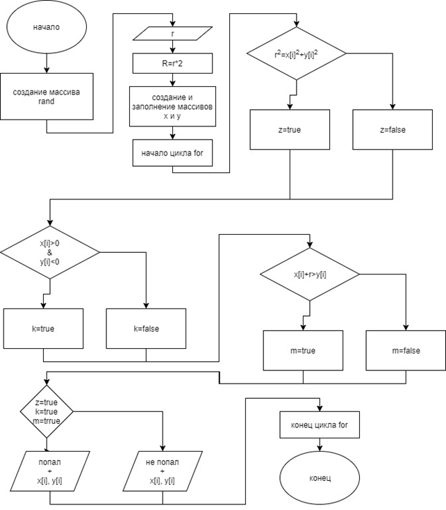

# Программа, вычисляющая, сколько раз, из 10, попал стрелок в определённую область мишени. Размер мишени задается пользователем.


### Блок-схема:




### Код:
``` C#
    namespace выстрелы
    {
        class Program
        {
            static void Main(string[] args)
            {
                
                
                bool k, m, z;
                Random rand = new Random();
                Console.WriteLine("введите радиус мишени");
                double r = double.Parse(Console.ReadLine()); // если хотите ввести дробное число, надо поставить запятую, а не точку.
                int R = (int)r * 2;
                Double[] x = new double[10];
                for (int i = 0; i < 10; i++)
                { x[i] = rand.NextDouble() * R - r; }

                Double[] y = new double[10];
                for (int i = 0; i < 10; i++)
                { y[i] = rand.NextDouble() * R - r; }

                    for (int i = 0; i < 10; i++)
                    {
                    if (r * r > Math.Pow(x[i], 2) + Math.Pow(y[i], 2))
                        z = true;
                    else z = false;

                    if (x[i] > 0 && y[i] < 0)
                        k = false;
                    else k = true;

                    if (x[i] + r > y[i])
                        m = true;
                    else m = false;

                    if (m == true && z == true && k == true)
                        Console.WriteLine("попал" +"  "+ x[i] +"  "+ y[i]);
                    else Console.WriteLine("не попал" + "  " + x[i] + "  " + y[i]);
                    }
                Console.ReadKey();
            }
        }
    }
```