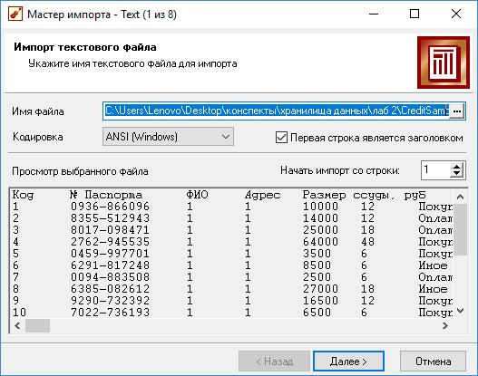
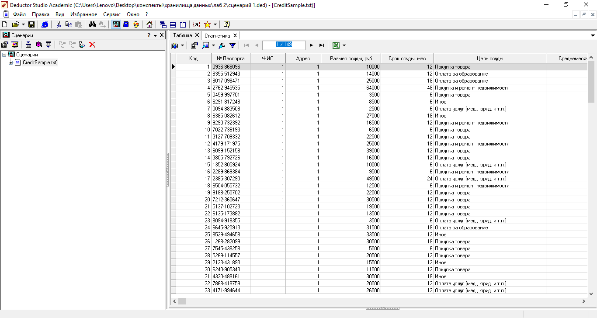
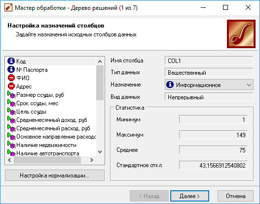
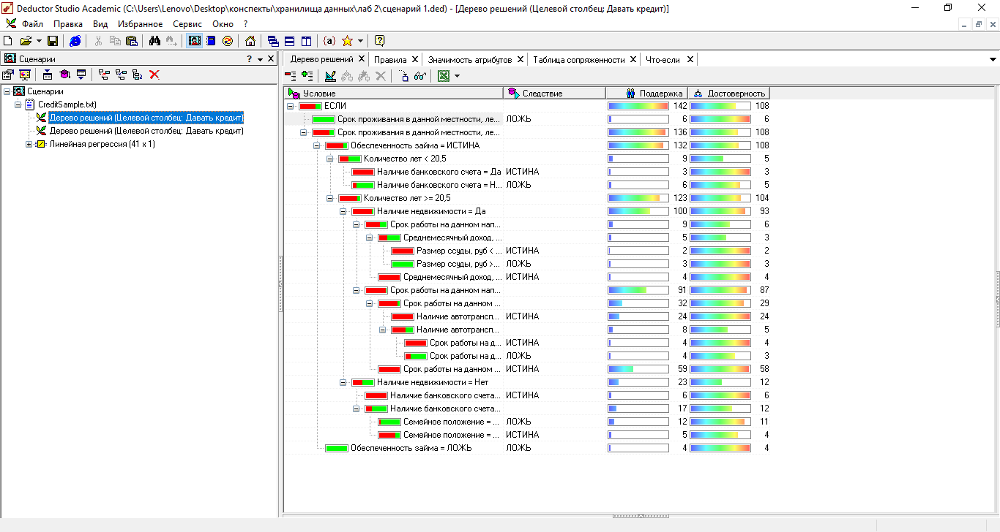
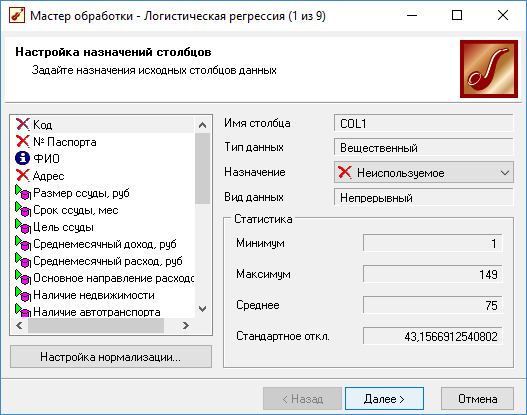
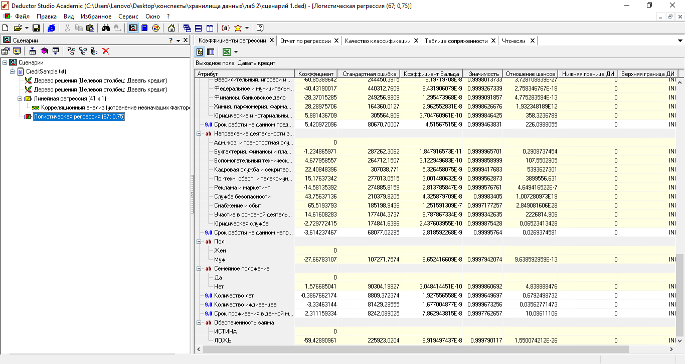
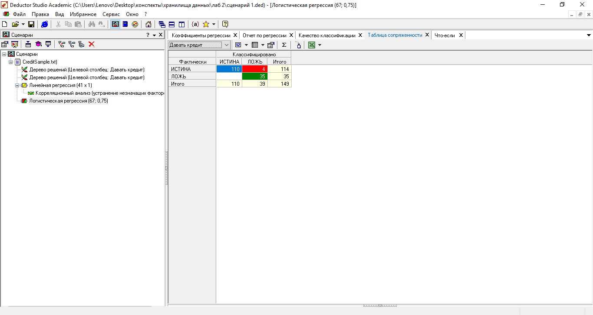
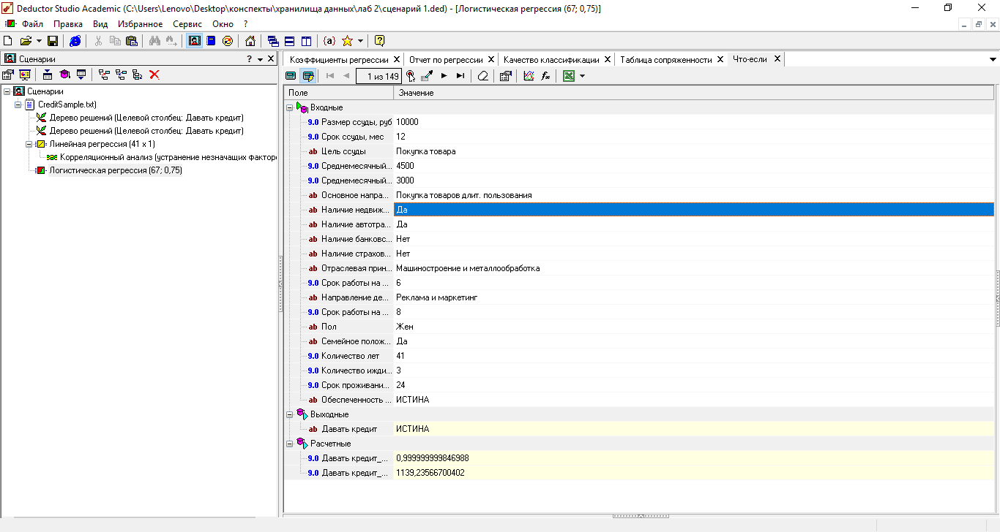
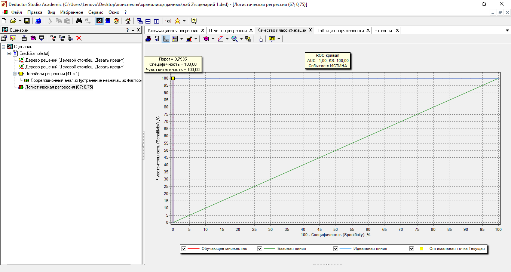
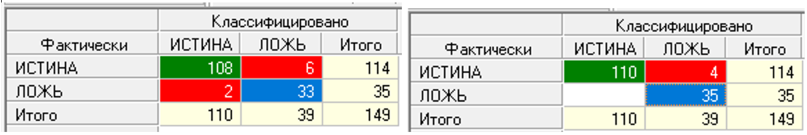

# Реализация алгоритма построения дерева решений и логистическая регрессия

### **Задание:** дается текстовый файл, в котором содержатся отчетные данные из банка относительно кредиторов и их выплат. Нам надо на основе этих данных написать программу, показывающую, при каких условиях стоит давать кредит, а при каких – нет.

Первым делом происходит импорт текстового файла в программу deductor studio:

После чего нам надо с помощью мастера обработки создать дерево решений:

Таким образом, работая в банке, с помощью дерева решений мы можем понять, стоит ли давать человеку кредит, исходя из этой статистики.

Исходя из полученных результатов, мы видим, что один из самых важных критериев – проживание в данной местности, если вы живете в этом месте меньше 6 лет, то вам не дадут кредит, так же у вас должна быть ссуда <9000р и обеспеченность займа.

## Часть 2. Логистическая регрессия и RОC-анализ.

Сначала мы с помощью мастера обработки создаем логистическую регрессию: 

И вот что получается:
* Коэффициенты регрессии:

* Таблица сопряженности:

Из неё следует, что 110 человек – «хороших», 4 из «хороших» оказались «плохими» и 35 человек – «плохие». 

* Что-если:

* Качество классификации:

Сравнивая таблицы сопряженности, мы видим, что они отличаются. В первой (дерево решений) 108 истины и 6 оказавшихся ложными, 33 ложных и 2, оказавшихся истинными, а во второй (логистическая регрессия) – 110 истинных и 4 оказавшихся ложными, 35 – полностью ложные. 

 