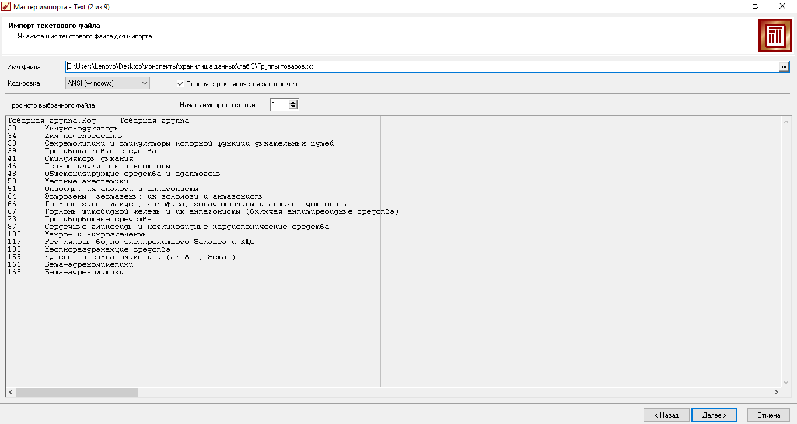
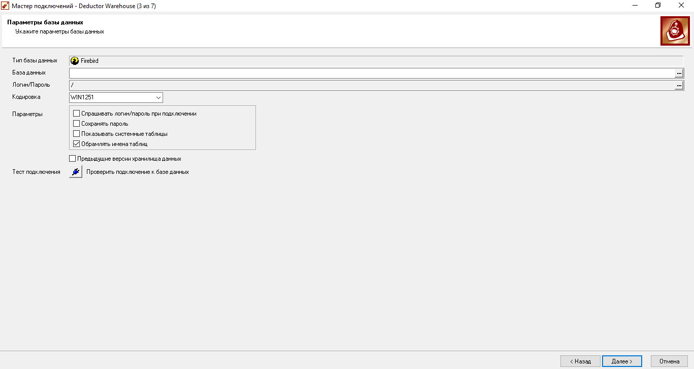
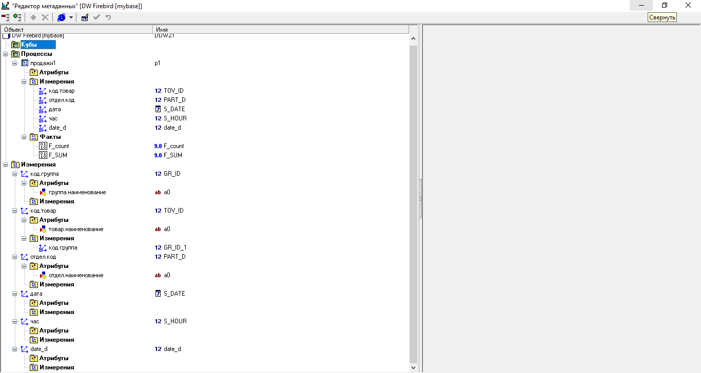
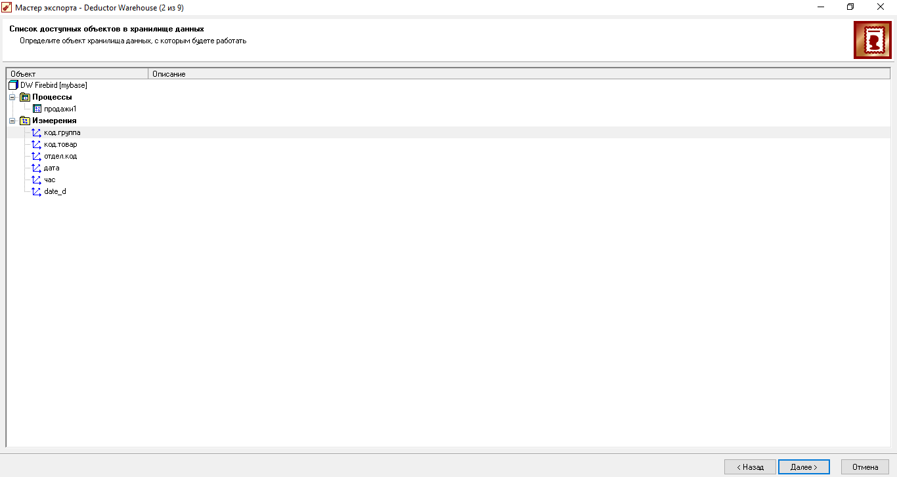
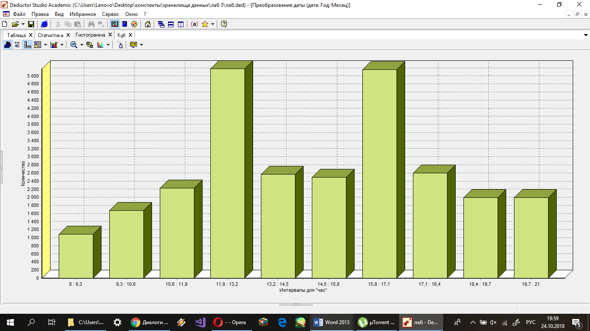
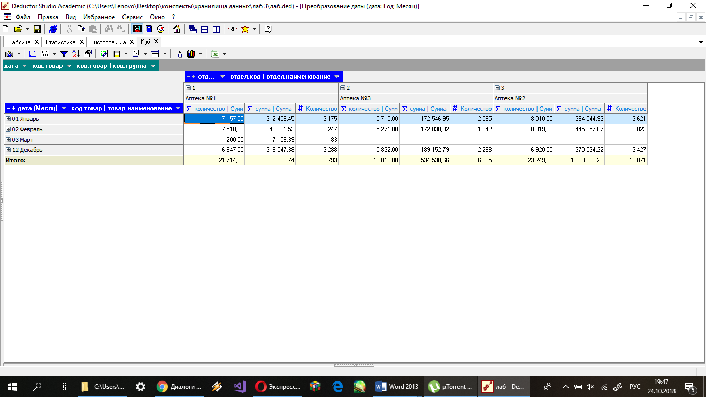
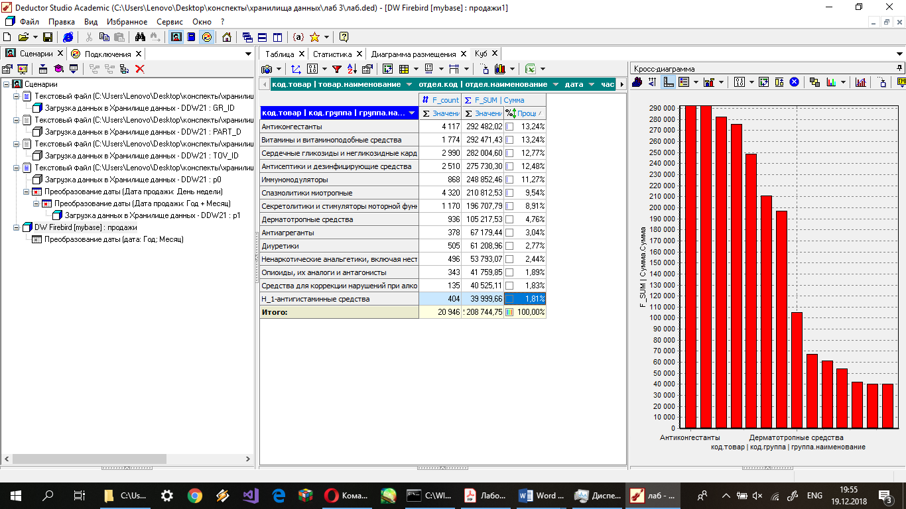
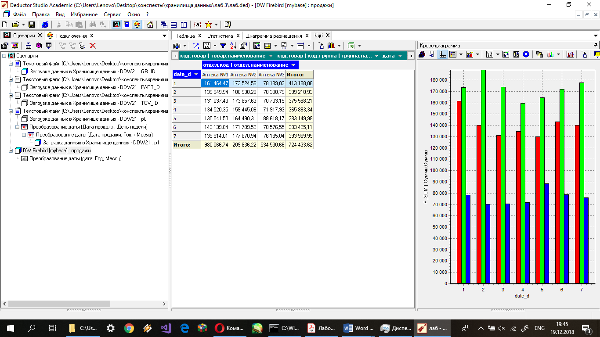

# Консолидация данных и отчетность аптечной сети

## Задание:
Компания, владеющая небольшой аптечной сетью, занимается розничной продажей лекарственных препаратов. Руководство компании приняло решение о внедрении системы аналитической OLAP-отчетности, в которой его интересует информация о динамике продаж, загруженности торговых точек, самых продаваемых товарах в различных разрезах. Так как существующая учетная система испытывает нагрузки (компания постоянно расширяет свою сеть), было решено создать единый консолидированный источник – хранилище данных, которое послужит базой для OLAP-отчетности.

Предварительно программисты компании создали процедуру выгрузки данных из учетной системы в структурированные текстовые файлы (в качестве пробы сформирована «пачка» данных за несколько месяцев).

### Требуется:
* спроектировать структуру реляционного хранилища данных (ХД);
* наполнить ХД первичной информацией;
* разработать процедуры пополнения ХД и контроль непротиворечивости содержащихся в нем данных;
* предложить набор OLAP-отчетов

## Ход работы
### Загрузка таблиц в deductor studio:

### Создание базы данных: 

### Структура базы данных:

### Привязка таблиц из «процесса» к базе данных (к измерениям): 

### Гистограмма получившейся таблицы:

### OLAP-анализ (Куб) 

На скриншоте сверху показан OLAP-анализ, исходя из которого понятно, что самый продаваемый товар – антиконгестанты.

На последнем скриншоте, на кросс-диаграмме представлены данные аптек, аптека 1 – красный цвет, аптека 2 – зеленый цвет и, соответственно, аптека 3 – синий цвет. Исходя из этих данных, мы видим, что самая успешная аптека №2.