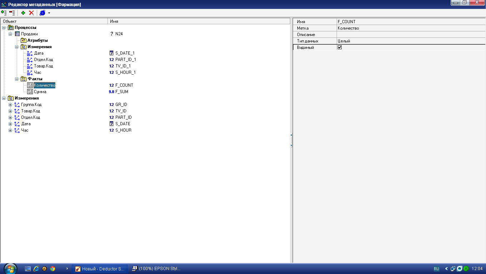

# Консолидация данных и отчетность аптечной сети

## Описание задачи

**Постановка задачи**. Компания, владеющая небольшой аптечной сетью, занимается розничной продажей лекарственных препаратов. Руководство компании приняло решение о внедрении системы аналитической OLAP-отчетности, в которой его интересует информация о динамике продаж, загруженности торговых точек, самых продаваемых товарах в различных разрезах. Так как существующая учетная система испытывает нагрузки (ком-пания постоянно расширяет свою сеть), было решено создать единый консо-лидированный источник – хранилище данных, которое послужит базой для OLAP-отчетности.

Предварительно программисты компании создали процедуру выгрузки данных из учетной системы в структурированные текстовые файлы (в каче-стве пробы сформирована «пачка» данных за несколько месяцев). Требуется:

* спроектировать структуру реляционного хранилища данных (ХД);
* наполнить ХД первичной информацией;
* разработать процедуры пополнения ХД и контроль непротиворе-чивости содержащихся в нем данных;
* предложить набор OLAP-отчетов

**Исходные данные**. Представлены в четырех файлах: Группы товаров.txt, Товары.txt, Отделы.txt, Продажи.txt.
Покажем последовательность решения задачи в аналитической плат-форме Deductor.

## Deductor Warehouse

Хранилище данных Deductor Warehouse – это специально организован-ная база данных, ориентированная на решение задач анализа данных и под-держки принятия решений, обеспечивающая максимально быстрый и удоб-ный доступ к информации. ХД Deductor Warehouse соответствует модели ROLAP (схема «снежинка») и может быть развернуто на одной из следующих СУБД: Firebird, SQL Server, Oracle (в версии Academic – только на Firebird). С Deductor Warehouse на базе Firebird имеется возможность работать локально при помощи динамической библиотеки `fbclient.dll` (поставляется вместе с Deductor).

Хранилище данных Deductor Warehouse включает в себя потоки дан-ных, поступающие из различных источников, и специальный семантический слой, содержащий так называемые метаданные (данные о данных). Семанти-ческий слой и сами данные хранятся в одной СУБД.

Запрос к хранилищу осуществляется непосредственно сквозь семанти-ческий слой, который через внутреннюю систему команд (скрытую от поль-зователя и аналитика) подбирает запрашиваемую информацию из многообра-зия хранимых данных. Работу семантического слоя можно сравнить с дея-тельностью библиотекаря, который по просьбе читателя достает с разроз-ненных полок книги и раскрывает их на нужных страницах.

Все данные в Deductor Warehouse хранятся в структурах типа «снежин-ка», где в центре расположены таблицы фактов, а «лучами» являются изме-рения, причем каждое измерение может ссылаться на другое измерение. Именно эта схема чаще всего встречается в реляционных хранилищах данных.

 Структура Deductor Warehouse

В *Deductor Warehouse* имеются следующие типы объектов.

*Измерение* – последовательность значений одного из анализируемых параметров. Например, для параметра *Время* - это последовательность кален-дарных дней, для параметра *Регион* – список городов. Каждое значение изме-рения может быть представлено координатой в многомерном пространстве процесса, например *Товар, Клиент, Дата*.

*Атрибут* – свойство измерения (то есть точки в пространстве). Атрибут как бы скрыт внутри другого измерения и помогает пользователю полнее описать исследуемое измерение. Атрибутами измерения *Товар* могут высту-пать *Цвет, Вес, Габариты*.

*Факт* – значение, соответствующее измерению. Факты – это данные, отражающие сущность события. Как правило, фактами являются численные значения, например сумма и количество отгруженного товара, скидка.

*Ссылка на измерение* – установленная связь между двумя и более из-мерениями. Дело в том, что некоторые бизнес-понятия (соответствующие из-мерениям в хранилище данных) могут образовывать иерархии, например, *Товары* могут включать *Продукты питания* и *Лекарственные препараты*, которые, в свою очередь, подразделяются на группы продуктов и лекарств и т. д. В этом случае первое измерение содержит ссылку на второе, второе – на третье и т.д.

*Процесс* – совокупность измерений, фактов и атрибутов. По сути, про-цесс и есть «куб», «снежинка». Процесс описывает определенное действие, например продажи товара, отгрузки, поступления денежных средств и пр.

*Атрибут процесса* – свойство процесса. Атрибут процесса, в отличие от измерения, не определяет координату в многомерном пространстве. Это справочное значение, относящееся к процессу, например *№ накладной*, *Валюта документа* и т.д. Значение атрибута процесса, в отличие от измерения, не всегда может быть определено.

В Deductor Warehouse может одновременно храниться множество про-цессов («звезд» или «снежинок»), имеющих общие измерения, например из-мерение Товар, фигурирующее в процессах *Поступления* и *Отгрузка*.

Все загружаемые в ХД данные обязательно должны быть определены как измерение, атрибут либо факт.

Проектирование структуры хранилища

Информация о принадлежности данных к тому или иному типу (изме-рение, ссылка на измерение, атрибут или факт) содержится в семантическом слое хранилища. Обратим внимание на то, что:

* *таблицы измерений* содержат только справочную информацию (коды, наименования и т.п.) и ссылки на другие измерения при необходимо-сти;
* *таблица процесса* содержит только факты и коды измерений (без их атрибутов).

## Проектирование хранилища «Фармация»

Первая подзадача – спроектировать структуру хранилища нашей ап-течной сети. Все данные представлены в четырех таблицах. Их фрагменты приведены ниже.

Группы товаров (фрагмент)(Табл. 1)

|Код группы|Наименование группы|
|--|--|
|33|	Иммуномодуляторы|
|48	|Общетонизирующие средства и адаптогены|
|50|	Местные анестетики|
|108|	Микро- и макроэлементы|
|198|	Витамины и витаминоподобные средства|
|223|	Желчегонные средства и препараты желчи|

___
 

Товары (фрагмент)(Табл. 2)

|Код товара|Наименование товара|Код группы|
|-|-|-|
|774	|Альмагель	|1|
|810	|Иммунорм	|33|
824	|Ревит	|198
898	|Настойка пустырника	|48

___
 

Отделы(Табл. 3)
|Код отдела	|Наименование отдела|
|--|--|
|1	|Аптека 1|
|2	|Аптека 2|
|3	|Аптека 3|

___
 

Продажи (фрагмент)(Табл. 4)

|Дата	|Код отдела	|Код товара	|Час покупки	|Количество	|Сумма|
|-|-|-|-|-|-|
01.01.2009	|1	|3382	|15	|1	|293,92
01.01.2009	|1	|18346	|17	|1	|22,15
01.01.2009	|2	|85600	|16	|1	|32,16
01.01.2009	|3	|62535	|14	|4	|202,72
01.01.2009	|2	|40315	|15	|3	|47,52
…	|…	|…	|…	|…	|…
___

 

Покажем, какие данные являются измерениями, какие – атрибутами, а какие – фактами и что представляет собой процесс.

В табл. 1 *Код группы* является измерением, а *Наименование группы* – его атрибутом.

В табл. 2 *Код товара* является измерением, *Наименование товара* – его атрибутом, а *Код группы* – ссылкой на одноименное измерение.

В табл. 3 *Код отдела* является измерением, а *Наименование отдела* – его атрибутом.

В табл. 4 *Дата* является измерением, *Код отдела, Код товара* и *Код группы*, как было сказано выше, – измерения, *Час покупки* – измерение, *Количество* и *Сумма* – факты. То есть табл. 4 представляет собой описание процесса продаж в трех аптеках.

При такой структуре ХД мы предполагаем, что уникальность точки в пространстве определяется совокупностью измерений *Дата + Товар + Код отдела + Час покупки*. То есть если в одной и той же аптеке в один и тот же день и час будет совершено несколько покупок, скажем, препарата «аналь-гин», то в хранилище данных будет отражена только одна запись.

Взаимоотношение измерений, атрибутов и фактов внутри процесса продаж в трех аптеках показано на рисунке ниже (см. выделенную строку табл. 4). В силу того, что визуально можно представить только трехмерное простран-ство, на рисунке показано взаимодействие трех измерений (*Дата, Код отдела* и *Код товара*). В рассмотренном примере измерений гораздо больше. Каждое новое может быть представлено новой осью.

 Измерения, атрибуты и факты внутри процесса продаж

##Создание хранилища

Запустите программу Deductor Studio Academic. Для создания нового пустого хранилища данных или подключения к существующему перейдите на вкладку Подключения меню **Вид**, щелкните правой кнопкой мыши и запусти-те **Мастер подключений**

 Создание (подключение) хранилища данных 

На первом шаге мастера следует выбрать тип источника (приемника) – Deductor Warehouse.

 Окно выбора типа подключения

На следующем шаге из единственно доступного в списке типа базы данных выберите Firebird. Задайте параметры базы данных, в которой будет создана физическая и логическая структура хранилища данных:
* база данных – `D:\farma.gdb` (или любой другой путь);
* логин – `sysdba`, пароль – `masterkey`;
* установите флажок **Сохранять пароль**.

 Установка параметров базы данных

На следующей вкладке выберите последнюю версию для работы с ХД Deductor Warehouse 5 (предыдущие версии необходимы для совместимости с предыдущими хранилищами). Нажмите кнопку **Создать файл базы данных с необходимой структурой метаданных** и по указанному ранее пути будет создан файл `farma.gdb` (появится сообщение о его успешном создании). Это и есть пустое хранилище данных.

Осталось выбрать визуализатор для подключения (здесь это **Сведения и Метаданные**) и задать имя, метку и описание нового хранилища.

 Настройка семантики имен для узла подключения

Имя хранилища может быть введено только латинскими буквами. По-сле нажатия кнопки Готово на дереве узлов подключений появится метка хранилища. 

Хранилище данных «Фармация»

Для проверки доступа к новому хранилищу данных воспользуйтесь кнопкой **Тестирование соединения**. Если спустя некоторое время появится сообщение «Тестирование соединения прошло успешно», то хранилище го-тово к работе. Сохраните настройки подключений, нажав соответствующую кнопку.

Если соединение по какой-либо причине установить не удалось, то бу-дет выдано сообщение об ошибке. В этом случае нужно проверить параметры подключения хранилища данных и при необходимости внести в них измене-ния (используйте для этого кнопку **Настроить подключение**).

Таким образом, создано пустое хранилище, в котором нет ни одного объекта (процесса, измерения, факта). Ранее мы спроектировали структуру хранилища данных аптечной сети. Осталось отразить ее в хранилище. Для этого предназначен **Редактор метаданных**, который вызывается нажатием кнопки **Открыть конструктор...** на вкладке **Подключения**. Выберите узел **Измерения**, щелкните правой кнопкой мыши, затем нажмите кнопку **Добавить** и создайте первое измерение **Код группы** со следующими параметрами:
* имя – GR_ID;
* метка – Группа.Код;
* тип данных – целый.

Метка – это семантическое название объекта хранилища данных, кото-рое увидит пользователь, работающий с ХД.

Проделайте аналогичные действия для создания всех остальных изме-рений, взяв параметры из табл. 5.

Параметры измерений

Измерение	|Имя	|Метка	|Тип данных
|-|-|-|-|
Код группы	|GR_ID	|Группа.Код	|Целый
Код товара	|TV_ID	|Товар.Код	|Целый
Код отдела	|PART_D	|Отдел.Код	|Целый
Дата	|S_DATE	|Дата	|Дата/время
Час покупки|	S_HOUR	|Час|	Целый

 
В результате структура метаданных хранилища будет содержать пять измерений.

Структура метаданных хранилища

К каждому измерению, кроме *Дата* и *Час*, добавьте текстовый атрибут. Для измерения *Группа.Код* это будет *Группа.Наименование*, для измерения *Товар.Код* – *Товар.Наименование*, для измерения *Отдел.Код* – *От-дел.Наименование*.

Каждое измерение может ссылаться на другое измерение, реализуя тем самым иерархию измерений. В нашем случае измерение *Товар.Код* ссылается на *Группа.Код*. Эту ссылку и установите путем простого добавления, а имя ссылки задайте GR_ID_1. Результат работы иллюстрирует следующий рисунок:

Формирование ссылки на измерение

После того как все измерения и ссылки на измерения созданы, присту-пайте к формированию процесса («снежинки»). Назовите его *Продажи* и до-бавьте в него ссылки на четыре существующих измерения: *Дата, Отдел.Код, Товар.Код, Час*. Кроме них, в процессе участвуют два факта: *Количество* и *Сумма*, причем первый – целочисленный, а второй – вещественный.

Создание метаданных процесса

На этом проектирование структуры и метаданных ХД закончено.

## Наполнение хранилища данных

После создания структуры хранилища данных оно представляет с собой пустой файл с настроенным семантическим слоем. В таком виде ХД готово к загрузке в него данных из внешних структурированных источников. Для этого необходимо написать соответствующий сценарий в Deductor Studio. Он дол-жен выполнять следующие функции:

* импорт данных в Deductor Studio из базы данных, учетной систе-мы или предопределенных файлов;
* опциональную предобработку данных, например очистку или преобразование формата;
* загрузку данных в измерения и процессы хранилища Deductor Warehouse.

В нашем примере исходными данными для ХД служат четыре тексто-вых файла: Группы товаров.txt, Товары.txt, Отделы.txt, Продажи.txt. Поэтому сценарий загрузки должен быть настроен на использование этих файлов в ка-честве источников данных.

При создании сценария необходимо строго придерживаться следующих правил.

* Первыми загружаются все измерения, имеющие атрибуты. Только после загрузки всех измерений загружаются данные в процесс(ы).
* Измерения нужно загружать, начиная с самого верхнего уровня иерархии и спускаясь ниже. Это крайне важно: в противном случае иерархия не будет создана.

 Схема сценария загрузки

* Допускается не загружать отдельно измерения, не имеющие атрибутов и не состоящие в иерархии измерений. Значения таких измерений можно создавать во время загрузки в процесс с помощью специальной опции.

Поясним второе правило. Измерение *Группа* находится в иерархии выше измерения *Товар*, поэтому последовательность загрузки из-мерений будет следующая: *Группа*, *Товар*.

 Иерархия измерений

Импортируйте все четыре текстовых файла в **Deductor** в том порядке, как это показано на следующем рисунке. Для этого из контекстного меню или нажатием клавиши **F6** нужно вызвать **Мастер импорта**, выбрать тип источника – тек-стовый файл и настроить параметры импорта. Последовательность создания узлов импорта должна быть такой, чтобы первыми следовали узлы импорта из файлов с таблицами измерений, и только в конце – таблица процесса Про-дажи.txt. Менять порядок веток сценария можно при помощи кнопок **CTRL + ↑ и CTRL + ↓**.

 Сценарий в Deductor

Покажем последовательность загрузки данных в измерение на примере первого измерения *Группа.Код.* Встав на первом узле, вызовите **Мастер экспорта** (контекстное меню или клавиша **F8**). Из списка типа приемников вы-берите *Deductor Warehouse*. 

 Экспорт в хранилище данных

На следующей вкладке из списка доступных хранилищ выберите нуж-ное под названием «Фармация». Далее требуется указать, в какое именно из-мерение будет загружаться информация. Это *Группа.Код*.

 Выбор объекта для экспорта

Осталось установить соответствие элементов объекта в хранилище данных с полями входного источника данных (то есть таблицы Группы това-ров.txt). В случае, когда имена полей и (или) метки в семантическом слое хранилища данных совпадают, делать ничего не нужно.

 Настройка соответствия полей

Нажатие кнопки **Пуск** на следующем шаге загрузит в измерение данные. При этом старые данные, если они были, обновятся.
Проделав аналогичные действия еще для двух измерений – *Отдел.Код, Товар.Код*, получим следующий сценарий.

 Незаконченный сценарий загрузки данных в ХД

Загрузка измерений на этом заканчивается, несмотря на то что остались еще два измерения – *Дата* и *Час*. Но они не имеют атрибутов и не участвуют в иерархии, поэтому их значения можно загрузить на этапе экспорта в процесс.

Загрузите данные в процесс *Продажи*. В отличие от загрузки измерений, в **Мастере экспорта** появляются два специфических шага.

На одном из них нужно задать параметры контроля непротиворечиво-сти данных в хранилище – указать измерения, по которым следует удалять данные из хранилища.

Выбирается действие, выполняемое в ситуации, когда в процесс загру-жается информация, которая совпадает по значениям из нескольких измере-ний. Может быть два варианта: удалить старые данные и загрузить новые или запретить удаление и оставить то, что было загружено ранее.

 Параметры для контроля непротиворечивости информации

Поясним операцию удаления на примере (следующий рисунок). Допустим, в хра-нилище имеется процесс с двумя измерениями: *Клиент* и *Дата*. Необходимо загрузить в хранилище данные о продажах за последние два дня. Если в наборе данных, который мы загружаем, имеются все сведения о продажах за эти два дня, то можно указать: «Удалять данные по измерению и выбрать та-ким измерением *Дата*». Программа определит, что по измерению *Дата* в исходных данных всего два значения, а потом удалит из хранилища в процессе *Продажи* всю информацию за эти два дня и загрузит новую.

 Иллюстрация контроля непротиворечивости

Подобный способ загрузки удобен еще и тем, что позволяет избежать коллизий, например, когда в хранилище имеются некорректные данные за ка-кой-то период. В таком случае лучше все данные за этот период удалить, а после загрузить новые корректные сведения.

На последней странице **Мастера экспорта** лучше оставить настройки по умолчанию.

 Дополнительные параметры загрузки в процесс

Флажок **Автоматически добавлять значения измерений** позволяет «на лету» добавлять новые значения в существующие измерения. Но пользо-ваться опцией нужно с осторожностью. В случае бездумного ее применения можно очень быстро засорить хранилище данных, так как любое значение измерения, даже неверное, будет занесено как реально существующее.

Флажок **Группировать данные перед загрузкой в хранилище** полезен в следующей ситуации: вы до конца не уверены, что совокупность измерений процесса обеспечит уникальность точки в многомерном пространстве, и од-новременно такой уровень детализации вас устраивает. В нашей задаче, если в таблице продаж встретятся две записи с одинаковыми значениями измерений (табл. 6), то при отсутствии установленного флажка **Группировать данные...** в хранилище попадет только вторая запись (последняя встретившаяся). Получится, что одна запись фактически поте¬ряется, хотя нужно просумми-ровать значения полей *Количество* и *Сумма*.

Случай, при котором совокупность измерений не дает уникальности (табл 6)

Дата	|Код отдела	|Код товара	|Час покупки	|Количество	|Сумма
|-|-|-|-|-|-|
16.12.2008	|1	|3381	|18	|2	|196,0
16.12.2008	|1	|3381	|18	1	|98,0

 

В **Мастере экспорта** можно задать любой вариант агрегации данных. Когда есть уверенность, что совокупность измерений процесса обеспечивает уникальность точки в многомерном пространстве, группировку можно не производить – это сэкономит время.

Дополнительные параметры загрузки в процесс

Окончательный сценарий загрузки приведен на рисунке ниже.

Окончательный сценарий загрузки

В результате всех вышеописанных действий будет:
* создано и наполнено хранилище данных;
* написан сценарий загрузки (пополнения) информации из источ-ников в ХД;
* продуман контроль непротиворечивости данных в ХД.

Заметим, что сценарий загрузки привязан не к данным непосредственно, а к их структуре, то есть в нем смоделирована последовательность действий, которые нужно выполнить для загрузки информации в ХД: имена фай-лов-источников, соответствие полей и т.д. Один раз созданный сценарий впо-следствии применяется для пополнения хранилища данных. Как правило, эти процедуры проводятся по регламенту в нерабочее время (например, ночью) с использованием пакетного или серверного режима.

## 

[//]: str26