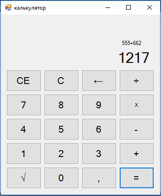
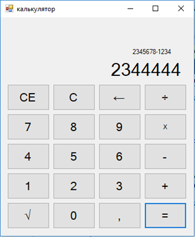

# Программа выполнена на платформе “Windows Forms”. Программа выполняет большинство действий калькулятора, использованы такие инструменты, как кнопки, поле ввода и этикетки (поля label). 2018 г.

## Результаты:

## Текст программы с комментариями:

    using System;
    using System.Collections.Generic;
    using System.ComponentModel;
    using System.Data;
    using System.Drawing;
    using System.Linq;
    using System.Text;
    using System.Threading.Tasks;
    using System.Windows.Forms;

    namespace калькулятор1
    {
        public partial class Form1 : Form
        {
            public Form1()
            {
                InitializeComponent();
            }
            int rar = 0; // обозначение переменных
            double x = 0;
            double y = 0;
            double z = 0;
            double a = 0;
            double b = 0;
            bool iseq = false;
            private void textBox1_TextChanged(object sender, EventArgs e)//ввод
            {

            }

            private void label1_Click(object sender, EventArgs e) // предыдущее число выводится в этом поле
            {

            }

            private void label2_Click(object sender, EventArgs e)
            {

            }
    

            private void button3_Click(object sender, EventArgs e) // цифра 0
            {
                if (iseq) { button18_Click(sender, e); }// очистка ненужных полей
                textBox1.Text =  textBox1.Text + (0.ToString());//вписывание в поле «textBox1» цифры «0».
            }

            private void button5_Click(object sender, EventArgs e)// цифра 1
            {
                if (iseq) { button18_Click(sender, e); } // если выражение уже посчитали, но поле еще заполнено, то выполняется действие кнопки 18
                textBox1.Text = textBox1.Text + (1.ToString());// добавление в textBox1 цифры 1
                
            }

            private void button6_Click(object sender, EventArgs e)// цифра 2
            {
                if (iseq) { button18_Click(sender, e); }
                textBox1.Text = textBox1.Text + (2.ToString());
            }

            private void button7_Click(object sender, EventArgs e)// цифра 3
            {
                if (iseq) { button18_Click(sender, e); }
                textBox1.Text = textBox1.Text + (3.ToString());
            }

            private void button9_Click(object sender, EventArgs e)// цифра 4 
            {
                if (iseq) { button18_Click(sender, e); }
                textBox1.Text = textBox1.Text + (4.ToString());
            }

            private void button10_Click(object sender, EventArgs e) // цифра 5
            {
                if (iseq) { button18_Click(sender, e); }
                textBox1.Text = textBox1.Text + (5.ToString());
            }

            private void button11_Click(object sender, EventArgs e) // цифра 6
            {
                if (iseq) { button18_Click(sender, e); }
                textBox1.Text = textBox1.Text + (6.ToString());
            }

            private void button13_Click(object sender, EventArgs e) // цифра 7
            {
                if (iseq) { button18_Click(sender, e); }
                textBox1.Text = textBox1.Text + (7.ToString());
            }

            private void button14_Click(object sender, EventArgs e) // цифра 8
            {
                if (iseq) { button18_Click(sender, e); }
                textBox1.Text = textBox1.Text + (8.ToString());
            }

            private void button15_Click(object sender, EventArgs e) // цифра 9
            {
                if (iseq) { button18_Click(sender, e); }
                textBox1.Text = textBox1.Text + (9.ToString());
            }
            private void button2_Click(object sender, EventArgs e) // запятая
            {
                if (iseq) { button18_Click(sender, e); }
                if (textBox1.TextLength == 0) { textBox1.Text = textBox1.Text + "0,"; }
                else { textBox1.Text = textBox1.Text + ","; }
            }

            private void button8_Click(object sender, EventArgs e) // кнопка сложения.
            {
                rar = 1;
                label2.Text = "+"; // поле label2 принимает значение «+»
                x = double.Parse(textBox1.Text); // считывание текста из textBox1 и присваивание его значения переменной «x»
                a = double.Parse(label1.Text); // считывание текста из label1 и присваивание его значения переменной «a»
                a =  x;
                label1.Text =(a.ToString());// присваивание полю label1 значения «a»
                textBox1.Text = ""; // удаление текста из поля textBox1
            }

            private void button12_Click(object sender, EventArgs e)// кнопка отрицания.
            {
                rar = 2;
                label2.Text = "-";
                x = double.Parse(textBox1.Text);
                a = double.Parse(label1.Text);
                a =  x;
                label1.Text = (a.ToString());
                textBox1.Text = "";
            }

            private void button16_Click(object sender, EventArgs e)//кнопка умножения
            {
                rar = 3;
                label2.Text = "x";
                x = double.Parse(textBox1.Text);
                a = double.Parse(label1.Text);
                a =  x;
                label1.Text = (a.ToString());
                textBox1.Text = "";
            }

            private void button20_Click(object sender, EventArgs e)// кнопка деления
            {
                rar = 4;
                label2.Text = "÷";
                x = double.Parse(textBox1.Text);
                a = double.Parse(label1.Text);
                a =  x;
                label1.Text = (a.ToString());
                textBox1.Text = "";
            }
            private void button1_Click(object sender, EventArgs e) // равно
            {
                x = double.Parse(label1.Text); // присваивание значения переменной «х»
                y = double.Parse(textBox1.Text); // присваивание значения переменной «у»
                if (rar == 1) // выполнение действий
                { z = x + y;
                    label1.Text = (x.ToString()) + "+" + (y.ToString());
                }
                if (rar == 2)
                { z = x - y;
                    label1.Text = (x.ToString()) + "-" + (y.ToString());
                }
                if (rar == 3)
                { z = x * y;
                    label1.Text = (x.ToString()) + "x" + (y.ToString());
                }
                if (rar == 4)
                { z = x / y;
                    label1.Text = (x.ToString()) + "/" + (y.ToString());
                }
                

                label2.Text =""; // присваивание пустого множества полю «label2»
                textBox1.Text = (z.ToString());
                iseq = true;
            }

            private void button18_Click(object sender, EventArgs e)// кнопка «c»
            {
                textBox1.Text = ""; // записывание пустого множества в поле «textBox1».
                label1.Text = "0";// записывание «2» в поле «label1».
                label2.Text = ""; // записывание пустого множества в поле «label2».
                iseq = false; // 
            }

            private void button17_Click(object sender, EventArgs e)// кнопка «ce»
            {
                textBox1.Text = ""; // записывание пустого множества в поле «textBox1».

            }

            private void button19_Click(object sender, EventArgs e) // del
            {
                string s1 = textBox1.Text; //считывание текста из поля «textBox1».
                int len = s1.Length; // получение длины строки «s1»
                s1=s1.Substring(0, len - 1); // удаление одного символа
                x = double.Parse(s1); // записывание значения получившегося числа в переменную «х».

                textBox1.Text = s1; // записывание значения получившегося числа в поле «textBox1».

            }

            private void button4_Click(object sender, EventArgs e) // данная кнопка извлекает квадратный корень.
            {
                x = double.Parse(textBox1.Text);  //считывание текста из поля «textBox1».
                x = Math.Sqrt(x); //функция извлекает квадратный корень.
                textBox1.Text = x.ToString();  // записывание значения получившегося числа в поле «textBox1».
            }
        }
    }
