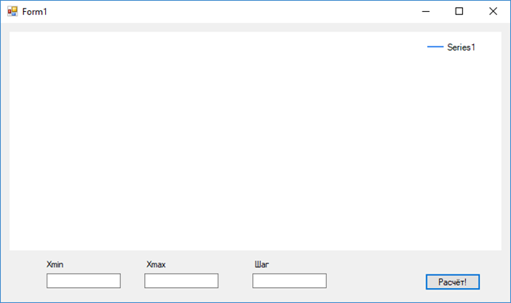
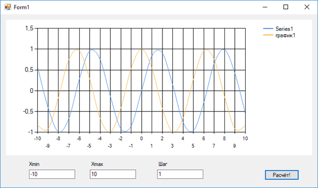

# Программа строит график функции y = (x^2 + 25)/x. В ней используются циклы, различные операторы, область для построения графиков, кнопки и поля для ввода.

## Результаты:

На данном скриншоте показана программа в начальном виде.

Здесь показана работа программы: при введенных данных создается график. 

    using System;
    using System.Collections.Generic;
    using System.ComponentModel;
    using System.Data;
    using System.Drawing;
    using System.Linq;
    using System.Text;
    using System.Threading.Tasks;
    using System.Windows.Forms;

    namespace lab_2_grafik
    {
        public partial class Form1 : Form
        {
            public Form1()
            {
                InitializeComponent();
            }
            Double Xmin = 0; // создание переменных
            Double Xmax = 0;
            Double step = 0;
            int i = 0;
            int k = 0;
            private void textBox1_TextChanged(object sender, EventArgs e)
            {

            }

            private void textBox2_TextChanged(object sender, EventArgs e)
            {

            }

            private void textBox3_TextChanged(object sender, EventArgs e)
            {

            }

            private void button1_Click(object sender, EventArgs e)
            {
                k=k + 1;
                chart1.Series.Add("график"+k); // название графика 
                Xmin = double.Parse(textBox1.Text); // присваивание значения переменным
                Xmax = double.Parse(textBox2.Text);
                step = double.Parse(textBox3.Text);

                int count = (int)Math.Ceiling((Xmax - Xmin)/step)+1;// кол-во точек графика

                double[] x = new double[count]; // создание массива с точками
                double[] y = new double[count];
                
                for (i = 0; i<count; i++)
                {
                    x[i] =step * i + Xmin;
                    y[i] = (int)Math.Ceiling((x[i]*x[i] + 25)/x[i]); // функция
                }
                chart1.ChartAreas[0].AxisX.Minimum = Xmin; // минимум
                chart1.ChartAreas[0].AxisX.Maximum = Xmax; // максимум
                chart1.ChartAreas[0].AxisX.MajorGrid.Interval = step; // шаг
                chart1.Series[0].Points.DataBindXY(x, y); // график

            }
        }
    }
