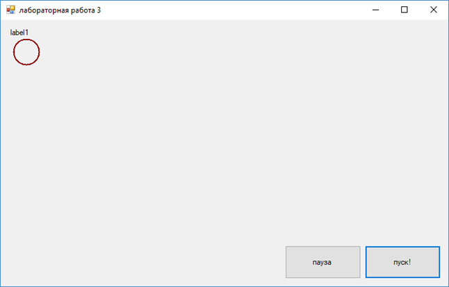
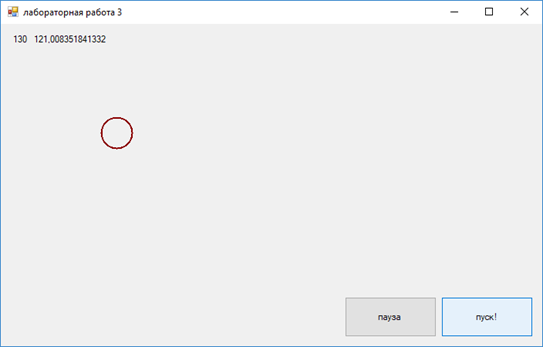
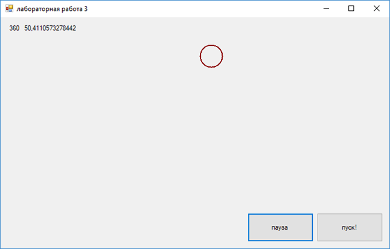

# Я создал программу, которая показывает движение окружности по синусоиде (знакомство с скринсейвером)

На данном скриншоте показана программа в ее начальном состоянии.

На данном и последующем скриншотах показана программа в рабочем состоянии.

## Код

    using System;
    using System.Collections.Generic;
    using System.ComponentModel;
    using System.Data;
    using System.Drawing;
    using System.Linq;
    using System.Text;
    using System.Threading.Tasks;
    using System.Windows.Forms;

    namespace lab3
    {
        public partial class Form1 : Form
        {
            public Form1()
            {
                InitializeComponent();
            }
            double x1, x2, y1, y2;
            double a, t, fi;
            private void button1_Paint(object sender, PaintEventArgs e)
            {
                
            }

            private void button1_Click(object sender, EventArgs e)
            {
            fi = -0.5;
                timer1.Start();// запуск таймера
            }

            private void button2_Click(object sender, EventArgs e)
            {
                timer1.Stop();// остановка таймера
            }

            private void label1_Click(object sender, EventArgs e)
            {

            }

            Pen pen = new Pen(Color.DarkRed, 2); // задание размера и цвета ручке
            private void Form1_Paint(object sender, PaintEventArgs e)
            {
                Graphics g = e.Graphics;
            
                g.DrawEllipse(pen, (int)x1, (int)y1, 40, 40); // эта функция рисует окружность и ставит ее в точку с координатами (х1,у1)
            }

            private void Form1_Load(object sender, EventArgs e)
            {
                x1 = 20; // присваивание значения переменным
                y1 = 30;
                fi = -0.5;
            }

            private void timer1_Tick(object sender, EventArgs e)
            {
                fi += 0.1;
                x1 = x1 + 5; // задание значения переменной х1
                y1 = 50*Math.Sin(x1/10)+100; // задание значения переменной y1
                Invalidate();
                label1.Text = "" + x1 + "   " + y1; // вывод значений переменных
            }

        }
    }
