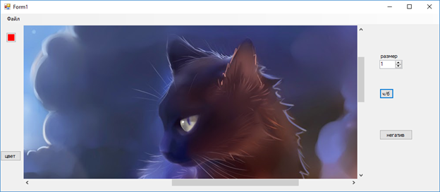

# Программа выполнена на платформе “Windows Forms”. С помощью нее можно создавать и изменять графические файлы.

## Результаты:

Начальный экран приложения

После загрузки изображения

Демонстрация работы приложения

## Код
    using System;
    using System.Collections.Generic;
    using System.ComponentModel;
    using System.Data;
    using System.Drawing;
    using System.Linq;
    using System.Text;
    using System.Threading.Tasks;
    using System.Windows.Forms;

    namespace lab_5__paint_2_
    {
        public partial class Form1 : Form // создание пространства для рисования
        {
            private Bitmap bmp;
            private Graphics g;
            private Point PreviousPoint, point;
            private Pen blackPen= new Pen(Color.Black, 1);
            int razm=1;
            public Form1()
            {
                InitializeComponent();
            }

            private void pictureBox1_Click(object sender, EventArgs e)
            {

            }
            private void numericUpDown1_ValueChanged(object sender, EventArgs e) // задание ручке размера
            {
                razm = (int)numericUpDown1.Value;
                blackPen.Width = razm;
                
            }
            private void button2_Click(object sender, EventArgs e)
            {
                if (colorDialog1.ShowDialog() == DialogResult.OK)
                {
                    blackPen = new Pen(colorDialog1.Color, razm); // задание определенных свойств ручке
                    blackPen.StartCap = System.Drawing.Drawing2D.LineCap.RoundAnchor;
                    blackPen.EndCap = System.Drawing.Drawing2D.LineCap.RoundAnchor;
                }
            }
            private void открытьToolStripMenuItem_Click(object sender, EventArgs e) // открытие файла
            {
                OpenFileDialog dialog = new OpenFileDialog();
                dialog.Filter = "Image files (*.BMP, *.JPG, " + "*.GIF, *.PNG)| *.bmp; *.jpg;*.gif;*.png";
                if (dialog.ShowDialog() == DialogResult.OK)
                {
                    Image image = Image.FromFile(dialog.FileName);
                    int width = image.Width;
                    int height = image.Height;
                    pictureBox1.Width = width;
                    pictureBox1.Height = height;
                    bmp = new Bitmap(image, width, height);
                    pictureBox1.Image = bmp;
                    g = Graphics.FromImage(pictureBox1.Image);
                }
            }
            private void сохранитьToolStripMenuItem_Click(object sender, EventArgs e) // сохранение файла
            {
    SaveFileDialog savedialog = new SaveFileDialog();
                savedialog.Title = "сохранить картнику как...";
                savedialog.OverwritePrompt = true;
                savedialog.CheckPathExists = true;
                savedialog.Filter = "Bitmap File(*.bmp)|*.bmp|" + "GIF File(*.gif)|*.gif|" + "JPEG File(*.jpg)|*.jpg|" + "PNG File (*.png)|*.png";
                if (savedialog.ShowDialog() == DialogResult.OK)
                {
                    string fileName = savedialog.FileName;
                    string strFilExtn = fileName.Remove(0, fileName.Length - 3);
                    switch (strFilExtn)
                    {
                        case "bmp":
                            bmp.Save(fileName, System.Drawing.Imaging.ImageFormat.Bmp);
                            break;
                        case "jpg":
                            bmp.Save(fileName, System.Drawing.Imaging.ImageFormat.Jpeg);
                            break;
                        case "gif":
                            bmp.Save(fileName, System.Drawing.Imaging.ImageFormat.Gif);
                            break;
                        case "tif":
                            bmp.Save(fileName, System.Drawing.Imaging.ImageFormat.Tiff);
                            break;
                        case "png":
                            bmp.Save(fileName, System.Drawing.Imaging.ImageFormat.Png);
                            break;
                        default:
                            break;
                    }
                }

            }
            private void сохранитьКакToolStripMenuItem_Click(object sender, EventArgs e) // сохранение файла
            {
                SaveFileDialog savedialog = new SaveFileDialog();
                savedialog.Title = "сохранить картнику как...";
                savedialog.OverwritePrompt = true;
                savedialog.CheckPathExists = true;
                savedialog.Filter = "Bitmap File(*.bmp)|*.bmp|" + "GIF File(*.gif)|*.gif|" + "JPEG File(*.jpg)|*.jpg|" + "PNG File (*.png)|*.png";
                if (savedialog.ShowDialog() == DialogResult.OK)
                {
                    string fileName = savedialog.FileName;
                    string strFilExtn = fileName.Remove(0, fileName.Length - 3);
                    switch (strFilExtn)
                    {
                        case "bmp":
                            bmp.Save(fileName, System.Drawing.Imaging.ImageFormat.Bmp);
                            break;
                        case "jpg":
                            bmp.Save(fileName, System.Drawing.Imaging.ImageFormat.Jpeg);
                            break;
                        case "gif":
                            bmp.Save(fileName, System.Drawing.Imaging.ImageFormat.Gif);
                            break;
                        case "tif":
                            bmp.Save(fileName, System.Drawing.Imaging.ImageFormat.Tiff);
                            break;
                        case "png":
                            bmp.Save(fileName, System.Drawing.Imaging.ImageFormat.Png);
                            break;
                        default:
                            break;
                    }
                }
            }

            private void button1_Click(object sender, EventArgs e)
            {
                for (int i = 0; i < bmp.Width; i++)
                    for (int j = 0; j < bmp.Height; j++)
                    {
                        int R = bmp.GetPixel(i, j).R;
                        int G = bmp.GetPixel(i, j).G;
                        int B = bmp.GetPixel(i, j).B;
                        int Gray = (R + G + B) / 3;
                        Color p = Color.FromArgb(255, Gray, Gray, Gray);
                        bmp.SetPixel(i, j, p);
                    }
                Refresh();
            }

            private void pictureBox1_MouseMove(object sender, MouseEventArgs e) // считывание движений мышки
            {
                if (e.Button == MouseButtons.Left)
                {
                    point.X = e.X;
                    point.Y = e.Y;
                    g.DrawLine(blackPen, PreviousPoint, point);
                    PreviousPoint.X = point.X;
                    PreviousPoint.Y = point.Y;
                    pictureBox1.Invalidate();
                }
            }

            private void Form1_Load(object sender, EventArgs e)
            {

            }

            private void button3_Click(object sender, EventArgs e) // негатив
            {
                for (int i = 0; i < bmp.Width; i++)
                    for (int j = 0; j < bmp.Height; j++)
                    {
                        int R = bmp.GetPixel(i, j).R;
                        int G = bmp.GetPixel(i, j).G;
                        int B = bmp.GetPixel(i, j).B;
                        Color p = Color.FromArgb(255, 255 - R, 255 - G, 255 - B);
                        bmp.SetPixel(i, j, p);
                    }
                Refresh();
            }

            

            private void button5_Click(object sender, EventArgs e) // задание ручке определенных свойств
            {
                blackPen = new Pen(Color.Red, razm);
                blackPen.StartCap = System.Drawing.Drawing2D.LineCap.RoundAnchor;
                blackPen.EndCap = System.Drawing.Drawing2D.LineCap.RoundAnchor;
            }

            private void pictureBox1_MouseDown(object sender, MouseEventArgs e) // считывание движений курсора
            {
                PreviousPoint.X = e.X;
                PreviousPoint.Y = e.Y;
            }

        }
    }
