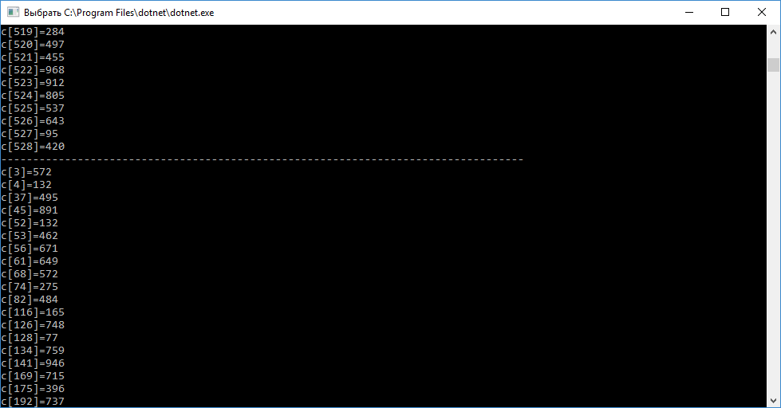
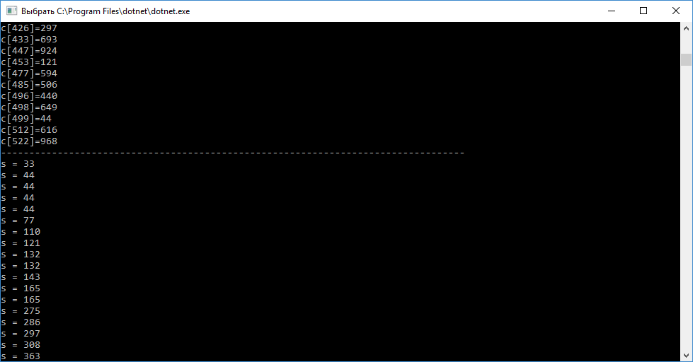
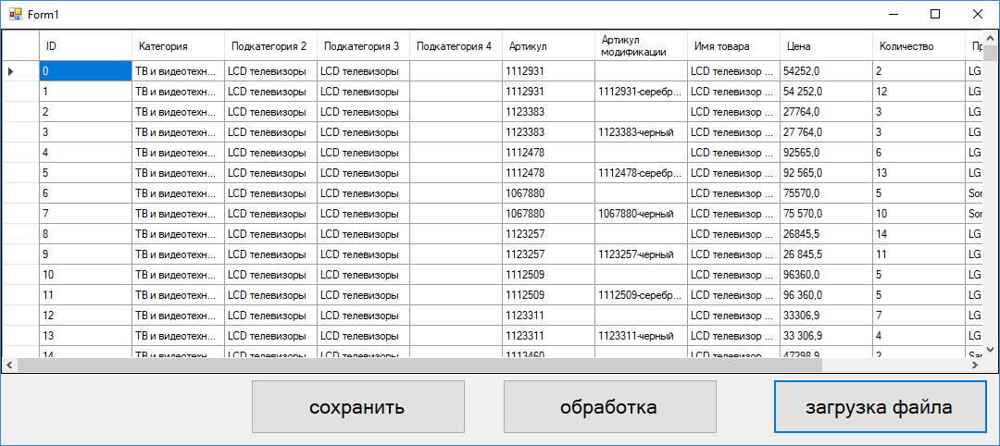
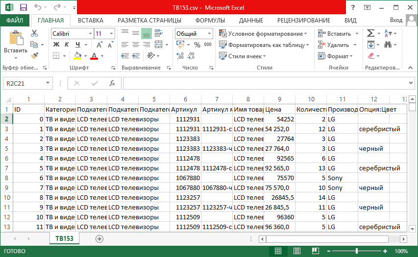

# Лабораторная работа №6 «DataGridView»

Первая программа выполняет сортировку чисел в диапазоне от 1 до 1000, эти числа генерируются сами в программе, как и длина массива (от 500 до 1000). Числа сортируются по признаку делимости на 11.сортировка выполнена двумя различными способами: с помощью цикла for  и вывода с помощью команды writeline и с помощью linq.

В программе использованы: запросы linq, циклы, создание различных переменных, в том числе рандомных.

Первая часть лабораторной работы:
``` c#
using System;
using System.Collections.Generic;
using System.Linq;
namespace ConsoleApp9
{
    class Program
    {
        static void Main(string[] args)
        {
            int i;
            Random rnd = new Random();// создание переменных
            int[] c = new int[rnd.Next(500,1000)]; // создание массива, длинной от 500 до 1000 символов
            for (i=0; i<c.Length;i++)  // начало цикла
            {
                c[i] = rnd.Next(1, 1000); // заполнение массива числами от 1 до 1000
                Console.WriteLine("c["+i+"]="+c[i]); // вывод массива на экран (в консоль)
                
            }
            Console.WriteLine("----------------------------------------------------------------------------------");
            // сортировка первым способом (с помощью цикла "for")
            for (i = 0; i < c.Length; i++) // начало цикла
            {
                
                if (c[i] % 11 == 0) // сортировка (выделение нужных элементов)
                {
                    Console.WriteLine("c[" + i + "]=" + c[i]); // вывод результата на экран (в консоль)
                }
            }
            Console.WriteLine("----------------------------------------------------------------------------------");
            // сортировка вторым способом (с помощью "linq")
            var sc = from t in c // определяем каждый объект из teams как t
                                where t % 11 == 0 //фильтрация по критерию
                                orderby t  // упорядочиваем по возрастанию
                                select t; // выбираем объект
            
            foreach (int s in sc) 
            {
                Console.WriteLine("s = " + s); // вывод результата на экран (в консоль)
            }
            Console.ReadKey();
        }
    }
}

```




Вторая программа загружает файл CSV, обрабатывает таблицу, оставляя лишь то, где подкатегория 3 = «LCD телевизоры», после чего загружает обработанную таблицу в текстовой файл CSV. В программе использовано множество компонентов DataGridView, циклы, массивы, различные переменные и строки.

Вторая часть лабораторной работы:

```c# 
using System;
using System.Collections.Generic;
using System.ComponentModel;
using System.Data;
using System.Drawing;
using System.Linq;
using System.Text;
using System.Threading.Tasks;
using System.Windows.Forms;

namespace lab_6_part_2
{
    public partial class Form1 : Form
    {
        public Form1()
        {
            InitializeComponent();
        }

        private void dataGridView2_CellContentClick(object sender, DataGridViewCellEventArgs e)
        {

        }

        private void dataGridView1_CellContentClick(object sender, DataGridViewCellEventArgs e)
        {

        }

        private void button1_Click(object sender, EventArgs e) // кнопка 1 (загрузка файла)
        {
            int tablelen = 0;
            if (openFileDialog1.ShowDialog() == DialogResult.OK)
            {
                string filename = openFileDialog1.FileName; // читаем файл в строку 
                string[] fileText = System.IO.File.ReadAllLines(filename, System.Text.Encoding.Default); // создание массива и запись в него таблицы
                string[] words;
                dataGridView1.Columns.Add("ID", "ID");  // создание столбца «ID»
                for (int c = 0; c < fileText.Length; c++)  // цикл
                {
                    words = fileText[c].Split(';'); // весь текст делится на отдельные части  
                    if (c == 0)
                    {
                        tablelen = words.Length; // присваивание переменной значения, соответствующего длине массива «words»
                        for (int k = 0; k < tablelen; k++)
                        {
                            dataGridView1.Columns.Add(words[k], words[k]); // запись в программу части таблицы
                        }
                    }
                    else
                    {
                        dataGridView1.Rows.Add();
                        for (int k = 0; k < tablelen; k++) 
                        {
                            dataGridView1[0, c - 1].Value = Convert.ToString(c - 1);
                            dataGridView1[k + 1, c - 1].Value = words[k]; // запись остальной части таблицы
                        }
                    }
                }
            }
           
        }

        private void openFileDialog1_FileOk(object sender, CancelEventArgs e)
        {
           
         

        }

        private void button2_Click(object sender, EventArgs e) // кнопка 2 (обработка)
        {
            List<DataGridViewRow> rows2 = new List<DataGridViewRow>  
        (from DataGridViewRow r in dataGridView1.Rows
         where r.Cells["Подкатегория 3"].Value!=null && r.Cells["Подкатегория 3"].Value.ToString().Equals("LCD телевизоры")  // сортировка
         select r);
            dataGridView1.Rows.Clear();// очистка первого листа
            foreach(var rr in rows2)
            {
                dataGridView1.Rows.Add(rr); // вывод
            }

        }

        private void saveFileDialog1_FileOk(object sender, CancelEventArgs e)
        {

        }

        private void button3_Click(object sender, EventArgs e) // сохранить
        {
            if (saveFileDialog1.ShowDialog() == DialogResult.OK)
            {
                string filename = saveFileDialog1.FileName;
                string s = "";
                int MaxD = 0;
                for (int c = 0; c < dataGridView1.Columns.Count; c++)
                {
                    MaxD = dataGridView1.Columns.Count; // присваивание переменной значения длины таблицы
                    
                }
                    for (int c= 0;c < dataGridView1.Columns.Count;c++)  // цикл, 
                    {
                       string cname = (string)dataGridView1.Columns[c].Name; // перенос данных в строку
                       s = s + cname; 
                       if (c != MaxD - 1 )
                       { s = s + ";"; }
                       else
                       {
                        s = s + "\r\n";
                       }
                    }
                for (int r = 0; r < dataGridView1.Rows.Count-1; r++)
                {
                    for (int c = 0; c < dataGridView1.Columns.Count; c++)
                    {
                        string cname = (string) dataGridView1[c,r].Value; 
                        s = s + cname; // запись данных в строку
                        if (c != MaxD - 1)
                        { s = s + ";"; }  // добавление точки с запятой
                        
                    }
                    if (!(r== dataGridView1.Rows.Count - 2))  s = s +  "\r\n";  // добавляется перенос строки
                }
                System.IO.File.AppendAllText(filename, s); // запись строки в файл
                
            }
        }
    }
}

```



