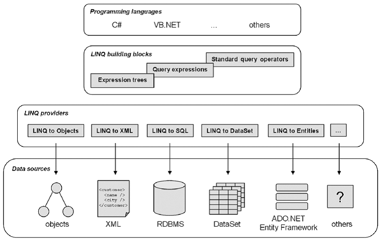

# LINQ запросы в C#. Таблицы DataGridView.
      
LINQ (Language-Integrated Query) представляет простой и удобный язык запросов к источнику данных. В качестве источника данных может выступать объект, реализующий интерфейс IEnumerable (например, стандартные коллекции, массивы), набор данных DataSet, документ XML. Но вне зависимости от типа источника LINQ позволяет применить ко всем один и тот же подход для выборки данных.

Существует несколько разновидностей LINQ:
* LINQ to Objects: применяется для работы с массивами и коллекциями
* LINQ to Entities: используется при обращении к базам данных через технологию Entity Framework
* LINQ to Sql: технология доступа к данным в MS SQL Server
* LINQ to XML: применяется при работе с файлами XML
* LINQ to DataSet: применяется при работе с объектом DataSet
* Parallel LINQ (PLINQ): используется для выполнения параллельной запросов

В этой главе речь пойдет прежде всего о LINQ to Objects, но в последующих материалах также будут затронуты и другие разновидности LINQ.



В чем же удобство LINQ? Посмотрим на простейшем примере. Выберем из массива строки, начинающиеся на определенную букву и отсортируем полученный список:

    string[] teams = {"Бавария", "Боруссия", "Реал Мадрид", "Манчестер Сити", "ПСЖ", "Барселона"};
    
    var selectedTeams = new List<string>();
    foreach(string s in teams)
    {
        if (s.ToUpper().StartsWith("Б"))
            selectedTeams.Add(s);
    }
    selectedTeams.Sort();
    
    foreach (string s in selectedTeams)
        Console.WriteLine(s);

Теперь проведем те же действия с помощью LINQ:

    string[] teams = {"Бавария", "Боруссия", "Реал Мадрид", "Манчестер Сити", "ПСЖ", "Барселона"};
    
    var selectedTeams = from t in teams // определяем каждый объект из teams как t
                        where t.ToUpper().StartsWith("Б") //фильтрация по критерию
                        orderby t  // упорядочиваем по возрастанию
                        select t; // выбираем объект
    
    foreach (string s in selectedTeams)
                Console.WriteLine(s);
        Console.WriteLine(s);

    string[] teams = {"Бавария", "Боруссия", "Реал Мадрид", "Манчестер Сити", "ПСЖ", "Барселона"};
    
    var selectedTeams = from t in teams // определяем каждый объект из teams как t
                        where t.ToUpper().StartsWith("Б") //фильтрация по критерию
                        orderby t  // упорядочиваем по возрастанию
                        select t; // выбираем объект
    
    foreach (string s in selectedTeams)
    Console.WriteLine(s);
Чтобы использовать функциональность LINQ, убедимся, что в файле подключено пространство имен System.LINQ.

Итак, код стал меньше и проще. В принципе все выражение можно было бы записать в одну строку: 

    var selectedTeams = from t in teams where t.ToUpper().StartsWith("Б") orderby t select t. 

Но для более понятной логической разбивки я поместил каждое отдельное подвыражение на отдельной строке.

Простейшее определение запроса LINQ выглядит следующим образом:

    from переменная in набор_объектов
    select переменная;

Итак, что делает этот запрос LINQ? Выражение ```from t in teams``` проходит по всем элементам массива ```teams``` и определяет каждый элемент как ```t```. Используя переменную ```t``` мы можем проводить над ней разные операции.

Несмотря на то, что мы не указываем тип переменной ```t```, выражения LINQ являются строго типизированными. То есть среда автоматически распознает, что набор teams состоит из объектов ```string```, поэтому переменная ```t``` будет рассматриваться в качестве строки.

Далее с помощью оператора ```where``` проводится фильтрация объектов, и если объект соответствует критерию (в данном случае начальная буква должна быть "```Б```"), то этот объект передается дальше.

Оператор ```orderby``` упорядочивает по возрастанию, то есть сортирует выбранные объекты.

Оператор ```select``` передает выбранные значения в результирующую выборку, которая возвращается LINQ-выражением.

В данном случае результатом выражения LINQ является объект ```IEnumerable<T>```. Нередко результирующая выборка определяется с помощью ключевого слова ```var```, тогда компилятор на этапе компиляции сам выводит тип.

Преимуществом подобных запросов также является и то, что они интуитивно похожи на запросы языка SQL, хотя и имеют некоторые отличия.

## Методы расширения LINQ
Кроме стандартного синтаксиса ```from .. in .. select``` для создания запроса LINQ мы можем применять специальные методы расширения, которые определены для интерфейса IEnumerable. Как правило, эти методы реализуют ту же функциональность, что и операторы LINQ типа where или orderby.

Например:

Запрос ```teams.Where(t=>t.ToUpper().StartsWith("Б")).OrderBy(t => t)``` будет аналогичен предыдущему. Он состоит из цепочки методов ```Where``` и ```OrderBy```. В качестве аргумента эти методы принимают делегат или лямбда-выражение.

Не каждый метод расширения имеет аналог среди операторов LINQ, но в этом случае можно сочетать оба подхода. Например, используем стандартный синтаксис ```linq``` и метод расширения ```Count()```, возвращающий количество элементов в выборке:

    int number = (from t in teams where t.ToUpper().StartsWith("Б") select t).Count();

## Список используемых методов расширения LINQ
* Select: определяет проекцию выбранных значений
* Where: определяет фильтр выборки
* OrderBy: упорядочивает элементы по возрастанию
* OrderByDescending: упорядочивает элементы по убыванию
* ThenBy: задает дополнительные критерии для упорядочивания элементов возрастанию
* ThenByDescending: задает дополнительные критерии для упорядочивания элементов по убыванию
* Join: соединяет две коллекции по определенному признаку
* GroupBy: группирует элементы по ключу
* ToLookup: группирует элементы по ключу, при этом все элементы добавляются в словарь
* GroupJoin: выполняет одновременно соединение коллекций и группировку элементов по ключу
* Reverse: располагает элементы в обратном порядке
* All: определяет, все ли элементы коллекции удовлятворяют определенному условию
* Any: определяет, удовлетворяет хотя бы один элемент коллекции определенному условию
* Contains: определяет, содержит ли коллекция определенный элемент
* Distinct: удаляет дублирующиеся элементы из коллекции
* Except: возвращает разность двух коллекцию, то есть те элементы, которые содератся только в одной коллекции
* Union: объединяет две однородные коллекции
* Intersect: возвращает пересечение двух коллекций, то есть те элементы, которые встречаются в обоих коллекциях
* Count: подсчитывает количество элементов коллекции, которые удовлетворяют определенному условию
* Sum: подсчитывает сумму числовых значений в коллекции
* Average: подсчитывает cреднее значение числовых значений в коллекции
* Min: находит минимальное значение
* Max: находит максимальное значение
* Take: выбирает определенное количество элементов
* Skip: пропускает определенное количество элементов
* TakeWhile: возвращает цепочку элементов последовательности, до тех пор, пока условие истинно
* SkipWhile: пропускает элементы в последовательности, пока они удовлетворяют заданному условию, и затем возвращает оставшиеся элементы
* Concat: объединяет две коллекции
* Zip: объединяет две коллекции в соответствии с определенным условием
* First: выбирает первый элемент коллекции
* FirstOrDefault: выбирает первый элемент коллекции или возвращает значение по умолчанию
* Single: выбирает единственный элемент коллекции, если коллекция содержит больше или меньше одного элемента, то генерируется исключение
* SingleOrDefault: выбирает первый элемент коллекции или возвращает значение по умолчанию
* ElementAt: выбирает элемент последовательности по определенному индексу
* ElementAtOrDefault: выбирает элемент коллекции по определенному индексу или возвращает значение по умолчанию, если индекс вне допустимого диапазона
* Last: выбирает последний элемент коллекции
* LastOrDefault: выбирает последний элемент коллекции или возвращает значение по умолчанию


