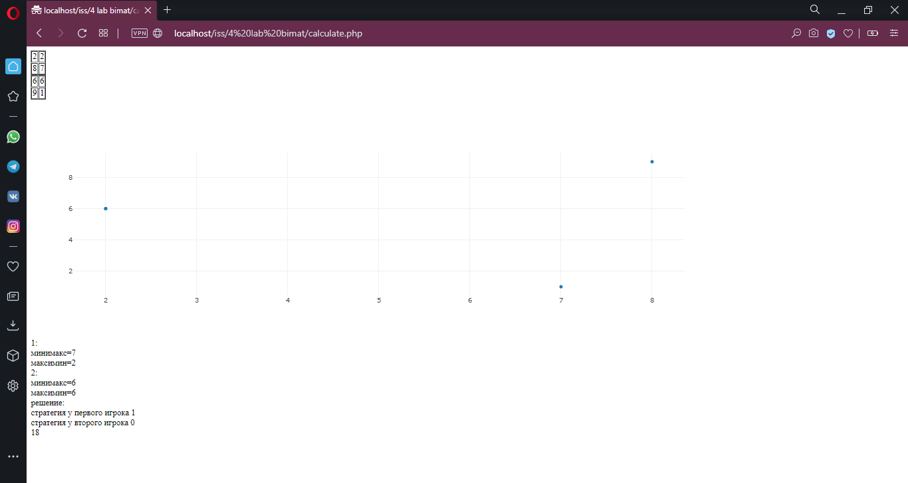

# биматричные игры
    2020 год
## Цель работы
Написание веб-приложения для решения биматричных игр.
## Полученные результаты
Был написан сайт на языках программирования php и html. Он состоит из трех страниц: на первой странице ввод размерности матриц; на второй – ввод данных матриц; на третьей – вывод результата вычислений.

 – ввод размерности матриц
 – ввод данных матиц
 – завершение работы приложения

## Список использованной литературы:
1)	https://math.semestr.ru/games/bimatrix.php  - онлайн калькулятор 
2)	https://ru.wikipedia.org/w/index.php?title=Матричные_игры&veaction=edit&section=0  - страница википедии.
3)	https://studopedia.su/15_109771_primeri-bimatrichnih-igr.html - теория биматричных игр.

©️kyoesu